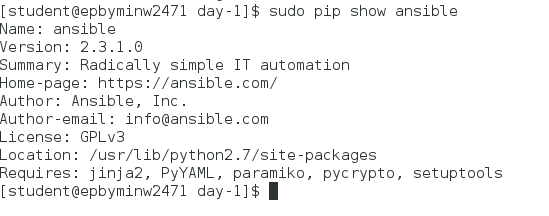
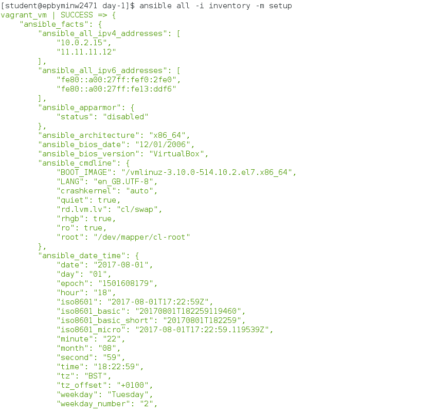
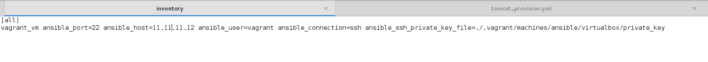
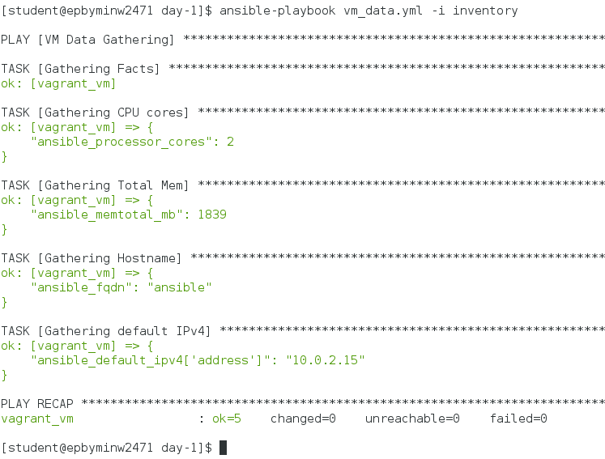
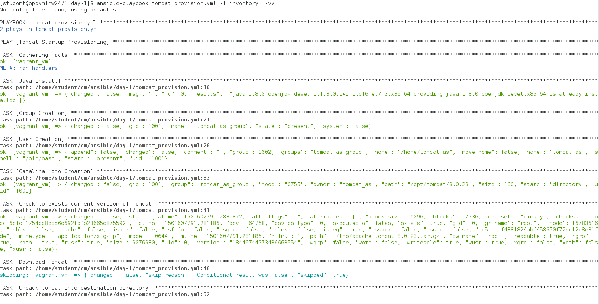
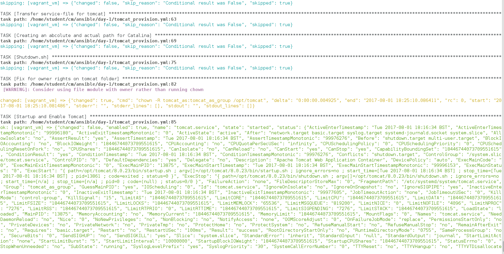
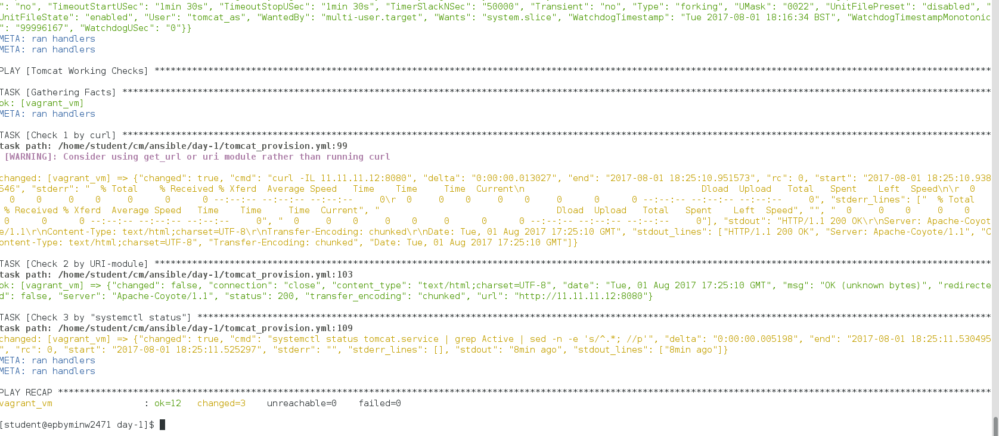
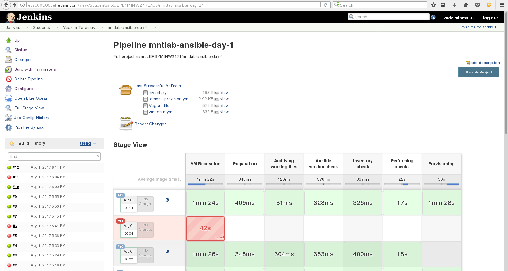

***1. Install Ansible v2.3.1 with python pip. Report details where ansible has been installed.***



***2. Create folder ~/cm/ansible/day-1. All working files are supposed to be placed right there.
3. Spin up clear CentOS6 VM using vagrant (“vagrant init sbeliakou/centos-7.3-minimal”). Verify connectivity to the host using ssh keys (user: vagrant)
4. Create ansible inventory file (name: inventory) with remote host connection details:***





***5. Test ansible connectivity to the VM with ad-hoc command: ***
```$ ansible VM-name -i inventory -m setup```
```Find out host details:```
* Number of CPUs
* Host name
* Host IP(s)
* Total RAM



***6. Develop a playbook (name: tomcat_provision.yml) which is supposed to run against any host (specified in inventory)***





__And builded with Jenkins__


