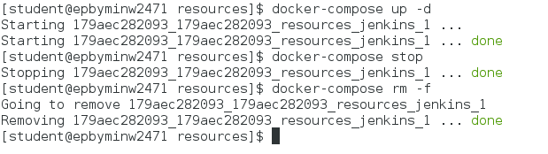
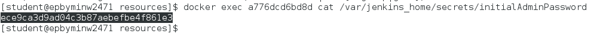
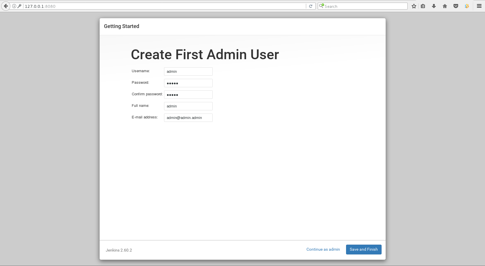
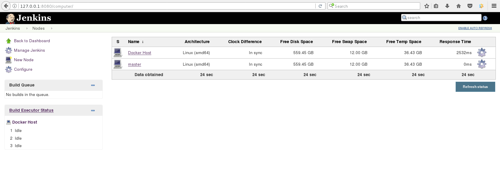
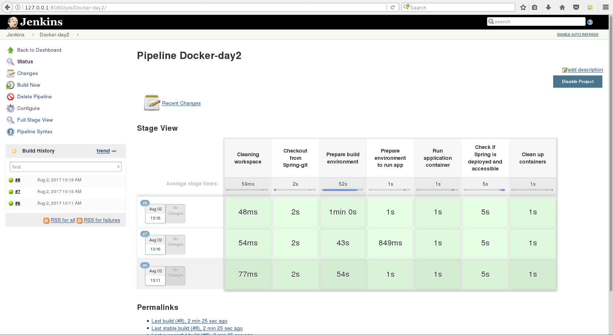
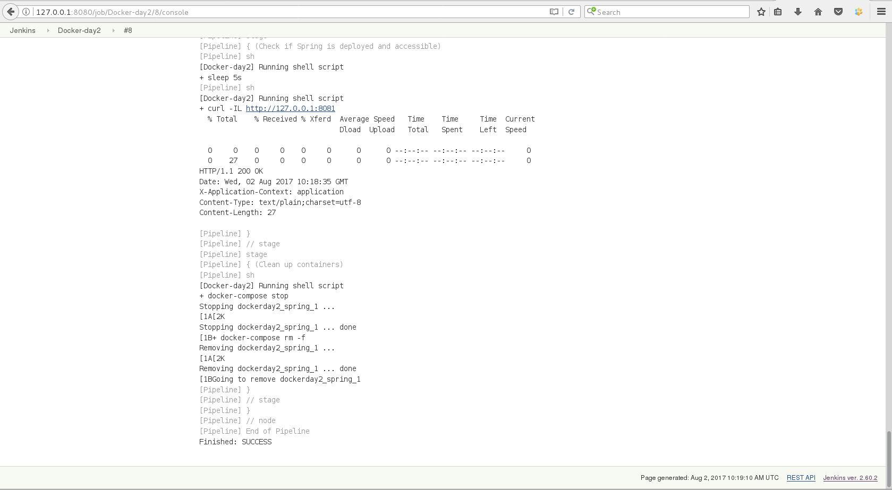

# Task 2: Vadzim Tarasiuk
1. Create custom ansible (v2.2.1) image
2. Launch Jenkins from [official image](https://hub.docker.com/_/jenkins/)

3. Link Docker Host as Jenknis slave (ssh)

4. Create custom gradle image
5. Configure a job to build [spring-boot application](https://spring.io/guides/gs/spring-boot/) using gradle image buit in 3
6. Configure a job to run just built Spring Boot app with docker-compose

